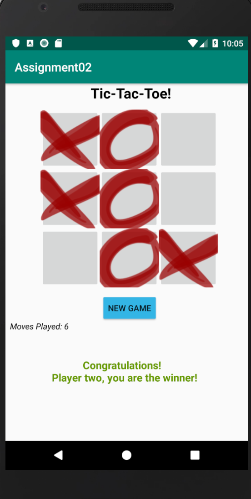

# TicTacToe

#### First Screenshot

#### Second Screenshot
##### I have done two things extra: Keep track of 'Moves Played' and added pictures for cross and circle

#### Third Screenshot
##### Player one wins the game

#### Fourth Screenshot
##### Player two wins the game

#### Fifth Screenshot
##### It's a tie

#### Sixth Screenshot
##### Invalid move

#### Landscape Screenshots
##### First Screenshot

#### Second Screenshot
##### I have done two things extra: Keep track of 'Moves Played' and added pictures for cross and circle

#### Third Screenshot
##### Player one wins the game

#### Fourth Screenshot
##### Player two wins the game

#### Fifth Screenshot
##### It's a tie

#### Sixth Screenshot
##### Invalid move

